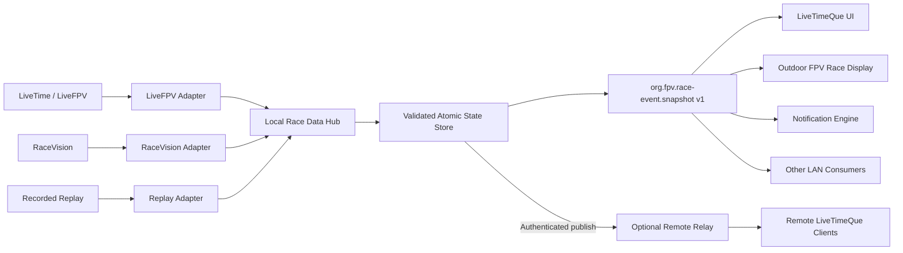

# Race Data Hub and LiveTimeQue Architecture Work Instructions

Status: architecture handoff
Audience: LiveTimeQue agent and Outdoor FPV Race Display agent
Scope: split source collection from user interfaces while preserving the existing local-first workflow

## 1. Goal

Build a reusable local Race Data Hub that owns all timing-system and source-specific work. Keep LiveTimeQue as the human-facing queue and notification application. Keep Outdoor FPV Race Display as a display consumer. Both applications must consume the same versioned race-event contract.

The target must support three operating modes without changing the consumer contract:

1. Bundled local mode: LiveTimeQue starts or embeds a local hub for a single user.
2. Event LAN mode: one event computer runs the hub and several local devices consume it.
3. Relay mode: the hub publishes to an authenticated remote relay so mobile and remote clients can consume the same event.

The first implementation target is local mode. Remote relay support must be designed into the seams, but it must not delay a reliable local hub.

## 2. Non-goals

- Do not make the Race Display parse LiveTime or RaceVision data directly.
- Do not make LiveTimeQue know LiveTime HTML selectors, Socket.IO packet positions, SignalR details, or RaceVision transport details.
- Do not copy LiveTimeAutoStream as a runtime dependency.
- Do not make a remote relay scrape LiveTime. Only a trusted source adapter may access the timing source.
- Do not require WebSockets for the first read-only data distribution path.
- Do not put LiveTime keys, RaceVision keys, OBS passwords, or source credentials into browser snapshots.
- Do not silently infer race completion, pilot channels, or the next heat from array position when the source has not proven the value.

## 3. Target topology



The source adapters are concrete implementations. `org.fpv.race-event.snapshot v1` is the data contract, not a source adapter and not a transport.

## 4. Responsibility map

### 4.1 LiveFPV / LiveTime source adapter

Owns:

- LiveFPV organization URL validation;
- results and heat-sheet retrieval;
- legacy LiveTime/LiveFPV socket handshake and room join;
- parsing race, clock, and driver packets;
- parsing heat-sheet pilot and channel assignments;
- matching the live race to a source-grounded heat-sheet race;
- source reconnect and rejoin;
- source-specific warnings and raw-source diagnostics.

Must not own:

- HTML rendering;
- WLED output;
- notification text or user preferences;
- mobile authentication;
- display presets;
- direct browser DOM access.

The LiveFPV adapter may contain separate private transport modules for HTTP heat sheets and the legacy socket. Externally it remains one deep adapter that produces normalized state.

### 4.2 RaceVision adapter

Owns:

- RaceVision-specific process, SignalR, HTTP, or capture transport;
- RaceVision authentication and key handling;
- mapping RaceVision fields to the internal source DTO;
- source-specific reconnect and diagnostics.

Must not own:

- LiveTimeQue UI state;
- WLED protocol handling;
- notification delivery;
- remote relay fan-out.

If RaceVision cannot provide a field with sufficient confidence, omit it and emit a quality warning. Never manufacture a channel or heat order.

### 4.3 Recorded replay adapter

Owns:

- loading recorded snapshots or redacted raw fixtures;
- deterministic replay timing;
- advancing or resetting a replay for tests and demos.

Must not own:

- live network access;
- production notification delivery;
- source credentials.

The replay adapter must satisfy the same source interface as live adapters so the UI and hub tests do not need source-specific branches.

### 4.4 Source normalizer and validator

Owns:

- converting source DTOs into `org.fpv.race-event.snapshot v1`;
- validating required fields and allowed status values;
- validating pilot identity, channel format, frequency units, timestamps, and schedule consistency;
- rejecting incomplete or contradictory candidate snapshots;
- attaching `quality.state` and warnings.

Must not own:

- source transport retries;
- HTTP/SSE/WebSocket serving;
- UI-specific labels or colors;
- notification policy.

The normalizer is the only module allowed to create a public v1 snapshot. Internal source DTOs may differ by adapter.

### 4.5 Atomic race state store

Owns:

- the last trusted snapshot;
- the currently staged candidate snapshot;
- atomic promotion of a validated candidate;
- sequence numbers and source revisions;
- `capturedAt`, `deliveredAt`, and freshness calculations;
- stale fallback after source failure;
- subscriber notification after promotion.

Must not own:

- HTML parsing;
- source-specific field positions;
- DOM rendering;
- notification wording.

No consumer may observe a partially merged race. A candidate is either rejected or promoted as one complete state.

### 4.6 Local Race Data Hub

Owns:

- starting and stopping the selected source adapter;
- coordinating scan/reconciliation and live updates;
- exposing the local read-only data interface;
- exposing health, source status, and metrics;
- optional authenticated upstream publishing to a relay;
- local configuration for source selection and listening address.

Must not own:

- LiveTimeQue page layout;
- Race Display/WLED scene rendering;
- source-specific parsing logic;
- pilot notification preferences;
- direct manipulation of browser localStorage.

The hub is the runtime seam between source adapters and consumers.

### 4.7 LiveTimeQue UI

Owns:

- overview, current heat, queue, schedule, and next-up presentation;
- user-selected pilot identity;
- local display preferences and themes;
- notification preferences and subscription UI;
- connection/freshness/error presentation;
- local bundled-mode hub lifecycle controls;
- consuming snapshots and streams.

Must not own:

- LiveTime page scraping;
- Socket.IO packet parsing;
- RaceVision protocol handling;
- source retry policy;
- the canonical race state;
- WLED display transport.

LiveTimeQue may calculate a user-specific projection such as “your next heat”, but it must not change the canonical schedule.

### 4.8 Notification engine

Owns:

- comparing accepted snapshots against prior state;
- deciding when a pilot reminder is due;
- deduplicating reminders using event/race/pilot/sequence keys;
- local notification delivery when running locally;
- handing remote push delivery to a relay-side notification worker.

Must not own:

- source collection;
- heat ordering;
- channel parsing;
- WLED output.

Notification logic must consume normalized snapshots and must remain usable with replay fixtures.

### 4.9 Outdoor FPV Race Display

Owns:

- mapping current, staging, next, and after-next races to the LED scene;
- semantic appearance presets;
- channel-to-color presentation;
- WLED/USB/WebSocket output;
- output connection status and pixel readback;
- preserving the last trusted display state.

Must not own:

- LiveTime or RaceVision collection;
- queue ordering;
- source reconciliation;
- notification delivery;
- credentials for timing systems.

## 5. Data and transport contracts

Keep the snapshot contract independent of transport:

```text
org.fpv.race-event.snapshot v1
```

Required transport endpoints for the hub:

```text
GET  /api/v1/health
GET  /api/v1/events/{eventId}/snapshot
GET  /api/v1/events/{eventId}/stream
```

The snapshot endpoint is the bootstrap and recovery path. The stream endpoint is the low-latency update path. Use SSE for the first read-only stream implementation. A WebSocket may be added later for bidirectional commands, but it must not become a second incompatible data contract.

Use one transport envelope for SSE and future WebSocket messages:

```json
{
  "type": "snapshot",
  "sequence": 1842,
  "capturedAt": "2026-09-05T12:30:04.200Z",
  "deliveredAt": "2026-09-05T12:30:04.240Z",
  "data": {
    "format": "org.fpv.race-event.snapshot",
    "version": 1
  }
}
```

The stream must also support `status`, `warning`, `heartbeat`, and `reset` events. A source disconnect must not leave clients looking connected forever. The hub must either reconnect internally or close the client stream so the client can reconnect.

For hub-to-relay publishing, start with authenticated HTTPS ingestion:

```text
POST /api/v1/ingest/events/{eventId}/snapshot
```

The relay fans out the same snapshot contract to remote clients. The relay must not require LiveTime credentials and must not scrape the timing source.

## 6. Responsibility migration from the current LiveTimeQue

Move into the Local Race Data Hub:

- LiveFPV results and heat-sheet fetching;
- LiveFPV scoring-page metadata parsing;
- Socket.IO handshake, room join, and packet parsing;
- source-specific reconnect and rejoin;
- current-race matching;
- channel/frequency extraction;
- source caching and stale-source decisions;
- snapshot publication.

Keep in LiveTimeQue:

- queue and heat views;
- current/next/after-next display logic;
- selected-pilot projection;
- notification preferences and presentation;
- connection and freshness indicators;
- replay/fixture consumer mode.

Remove from LiveTimeQue's UI layer:

- direct LiveTime HTML parsing;
- direct LiveFPV Socket.IO parsing;
- duplicated source freshness logic;
- source-specific retry branches;
- assumptions that the next numeric heat is always the next valid heat.

The first migration must preserve the current All-in-One experience by starting the hub locally as a managed sidecar or bundled process. The user should not need to understand the split.

## 7. Responsibility migration for Outdoor FPV Race Display

The display project should consume the v1 snapshot through a small connector client. It must not import LiveTimeQue parser code or RaceVision code.

The display-side connector client owns only:

- configuring the hub URL;
- requesting the bootstrap snapshot;
- subscribing to SSE;
- validating the envelope and v1 snapshot;
- reconnecting the stream;
- keeping the last trusted snapshot visible;
- exposing normalized data to the display scene renderer.

The display-side connector client must not own:

- heat-sheet retrieval;
- source reconciliation;
- source credentials;
- channel inference;
- notification policy.

## 8. Implementation sequence for the LiveTimeQue agent

### Phase L1: Freeze the seam

1. Document the current consumer-facing snapshot contract and version it explicitly.
2. Define a source adapter interface and a hub state-store interface.
3. Add replay and in-memory adapters as test implementations.
4. Keep existing UI routes working during the migration.

### Phase L2: Extract LiveFPV collection

1. Move the LiveFPV results/heat-sheet collector behind the adapter interface.
2. Move the Socket.IO handshake and packet parser behind the same adapter.
3. Implement source-level reconnect, room rejoin, and explicit status transitions.
4. Normalize only after current-race matching and channel mapping are complete.
5. Add fixtures for staging, running, complete, heat advance, empty driver packets, and R8.

### Phase L3: Introduce the hub runtime

1. Add local `/api/v1/health`, `/snapshot`, and `/stream` endpoints.
2. Add the atomic state store and sequence numbers.
3. Make the UI use bootstrap snapshot plus stream only.
4. Ensure source failures preserve the last trusted state with visible stale metadata.
5. Start the hub automatically in bundled local mode.

### Phase L4: Move notifications

1. Make notification decisions from normalized snapshots.
2. Add deterministic deduplication keys.
3. Keep local notification delivery working without a relay.
4. Define a relay notification interface without requiring remote deployment yet.

### Phase L5: Add RaceVision

1. Implement a separate RaceVision adapter.
2. Keep it behind the same source seam.
3. Use explicit field-confidence warnings where RaceVision cannot provide schedule or channel information.
4. Do not change the UI or snapshot consumer for the new source.

## 9. Implementation sequence for the Outdoor FPV Race Display agent

### Phase D1: Replace source assumptions with a hub client

1. Configure a hub base URL separately from the event source URL.
2. Request the v1 bootstrap snapshot.
3. Subscribe to the v1 SSE stream.
4. Validate message type, sequence, format, version, and quality state.
5. Keep the last trusted display state during reconnects.

### Phase D2: Preserve the display contract

1. Continue using the existing current/staging/next projections.
2. Preserve persistent channel colors across updates.
3. Continue atomic layout/schema updates for WLED.
4. Keep WLED connection recovery independent from race-source recovery.
5. Show source age and hub status separately from WLED status.

### Phase D3: Verify LAN operation

1. Test one hub and one display on localhost.
2. Test one hub and two LAN clients.
3. Stop the hub and verify stale-state rendering.
4. Restart the hub and verify automatic bootstrap and stream recovery.
5. Advance a heat and verify pilots and R8 remain correct.

## 10. Acceptance criteria

The migration is complete only when all of these are true:

- LiveTimeQue can run locally with an automatically managed hub.
- The Race Display can consume the same hub without knowing LiveTime internals.
- A replay adapter can drive both UIs without network access.
- Current Heat, Next Up, pilots, and channels come from the same validated snapshot.
- A source disconnect results in an explicit reconnecting/degraded/stale state.
- A reconnect cannot silently replay a stale previous heat.
- Multiple clients receive the same sequence of snapshots.
- A late-joining client receives the current snapshot immediately.
- No client has to scrape LiveTime directly.
- No browser client receives source credentials.
- Notification tests pass with recorded snapshots.
- The local event workflow remains usable when the remote relay is unavailable.
- The v1 contract remains transport-independent and versioned.

## 11. Decision summary

The Local Race Data Hub becomes the source and distribution layer. LiveTimeQue remains the queue, overview, and notification application. Outdoor FPV Race Display remains a specialized consumer. The shared snapshot contract is the seam; concrete source adapters sit behind it, and HTTP/SSE/WebSocket are transports around it.

Do not implement the remote relay before the local hub, atomic state store, reconnect lifecycle, and v1 contract are reliable. The relay is an optional fan-out deployment of the same hub data, not a second source collector.
